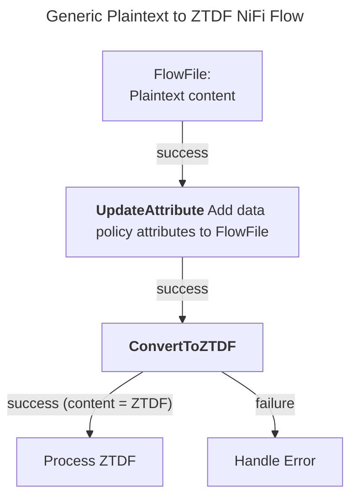
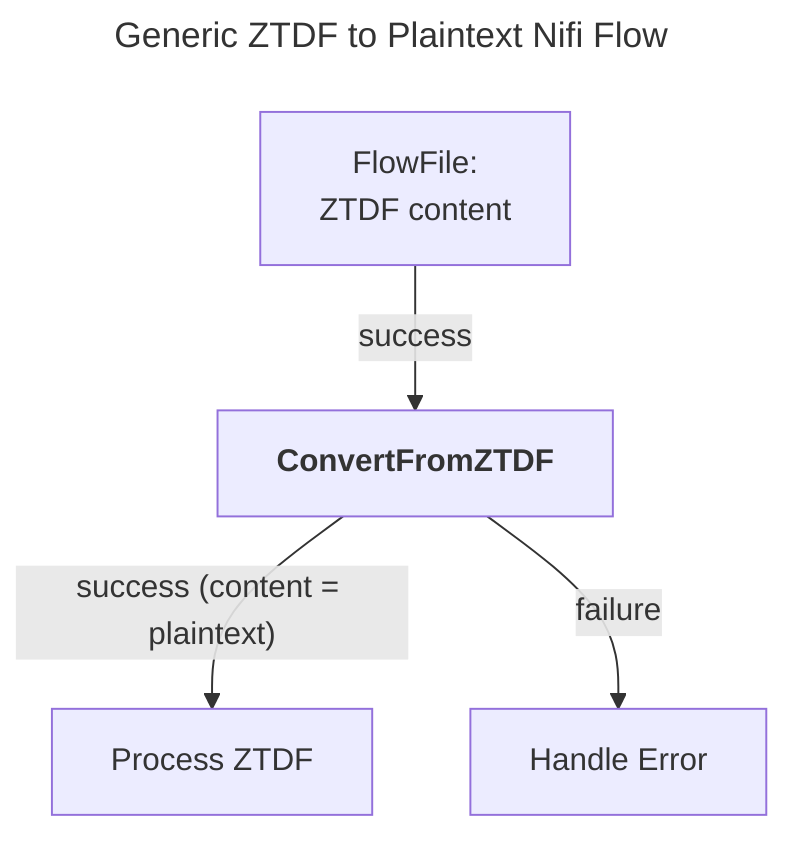

# OpenTDF NiFi
Integration of the [OpenTDF Platform](https://github.com/opentdf/platform) into [NiFi](https://nifi.apache.org/)

Components:
* "Zero Trust Data Format" (ZTDF) Processors: 
  * [ConvertToZTDF](./nifi-tdf-processors/src/main/java/io/opentdf/nifi/ConvertToZTDF.java): A NiFi processor that converts FlowFile content to ZTDF format. Does not currently support assertions 
  * [ConvertFromZTDF](./nifi-tdf-processors/src/main/java/io/opentdf/nifi/ConvertFromZTDF.java): A NiFi processor that converts ZTDF formatted FlowFile content to it's plaintext representation
* NanoTDF Processors ([See NanoTDF Specification](https://github.com/opentdf/spec/tree/main/schema/nanotdf#readme)):
    * [ConvertToNanoTDF](./nifi-tdf-processors/src/main/java/io/opentdf/nifi/ConvertToNanoTDF.java): A NiFi processor that converts FlowFile content to NanoTDF format. Does not currently support assertions
    * [ConvertFromNanoTDF](./nifi-tdf-processors/src/main/java/io/opentdf/nifi/ConvertFromNanoTDF.java): A NiFi processor that converts NanoTDF formatted FlowFile content to it's plaintext representation

* Controller Services:
  * [OpenTDFControllerService](./nifi-tdf-controller-services-api/src/main/java/io/opentdf/nifi/OpenTDFControllerService.java): A NiFi controller service providing OpenTDF Platform Configuration


#### FlowChart: Generic Plaintext to ZTDF Nifi Flow



#### FlowChart: Generic ZTDF to Plaintext Nifi Flow


# Quick Start - Docker Compose

1. Build the NiFi Archives (NARs) and place in the docker compose mounted volumes
    ```shell
    make compose-package
    ```
1. Start docker compose
    ```shell
    docker compose up
    ```
1. [Log into NiFi](http://localhost:18080/nifi)
