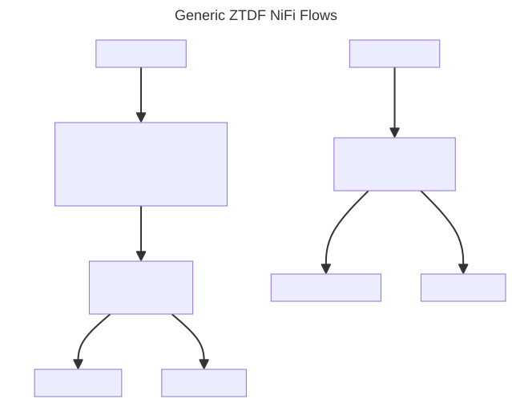

# OpenTDF NiFi

Integration of the [OpenTDF Platform](https://github.com/opentdf/platform) into [Apache NiFi](https://nifi.apache.org/). Provides processors for TDF encryption/decryption and attribute-based access control (ABAC) enforcement on any flow file — including binary protocol streams that cannot be TDF-wrapped.

## Processors

### TDF Encryption

| Processor | Description |
|-----------|-------------|
| [ConvertToZTDF](./nifi-tdf-processors/src/main/java/io/opentdf/nifi/ConvertToZTDF.java) | Encrypts flow file content as a Zero Trust Data Format (ZTDF) object, binding OpenTDF policy attributes to the ciphertext. Set **Enable Encryption = false** to tag a flow file with policy attributes without encrypting the payload (ABAC-only / tag-only mode). |
| [ConvertFromZTDF](./nifi-tdf-processors/src/main/java/io/opentdf/nifi/ConvertFromZTDF.java) | Decrypts a ZTDF-formatted flow file back to plaintext using the configured KAS endpoint. |

### Binary Protocol Support

| Processor | Description |
|-----------|-------------|
| [ParseJREAPC](./nifi-tdf-processors/src/main/java/io/opentdf/nifi/ParseJREAPC.java) | Parses JREAP-C (Joint Range Extension Applications Protocol Category C) binary message headers and extracts policy-relevant fields — classification, J-series word type, track number, source/destination addressing, and timestamp — as flow file attributes. Optionally populates `tdf_attribute` automatically from the classification level when a **Classification Attribute Namespace** is configured, making it directly consumable by `ABACEnforcement` downstream. Payload bytes are passed through unmodified. |
| [ABACEnforcement](./nifi-tdf-processors/src/main/java/io/opentdf/nifi/ABACEnforcement.java) | Calls the OpenTDF Authorization Service `GetDecisions` endpoint to make an ABAC permit/deny decision for the flow file. Uses the `tdf_attribute` flow file attribute as the resource context. Routes to **permit**, **deny**, or **failure** relationships. Supports a **Fail Open** property to control behavior when the authorization service is unreachable. Designed to enforce policy on binary protocol streams (JREAP-C, sensor feeds, telemetry) that cannot be encrypted as TDF but still require access control. |

### Controller Services

| Service | Description |
|---------|-------------|
| [OpenTDFControllerService](./nifi-tdf-controller-services-api/src/main/java/io/opentdf/nifi/OpenTDFControllerService.java) | Shared controller service providing OpenTDF Platform configuration (endpoint, OIDC credentials, KAS URL) to all TDF processors. |

## What This Enables

**Standard TDF flow** — encrypt data in NiFi and enforce policy downstream:

```
[Source] → [ConvertToZTDF] → [storage / transit] → [ConvertFromZTDF] → [Consumer]
```

**ABAC-only flow for binary protocols** — enforce policy without modifying payload bytes:

```
[JREAP-C source] → [ParseJREAPC] → [ABACEnforcement] → permit → [forward]
                                                      → deny   → [drop / audit]
                                                      → failure → [error handling]
```

This pattern is the NiFi equivalent of the `GATEWAY_ABAC_ENCRYPT_EMAIL=0` mode in gateway deployments: attribute tagging and policy enforcement happen without wrapping the content as TDF. It applies wherever the payload format is fixed (Link 16/JREAP-C, sensor feeds, telemetry streams) and the flow requires access control without encryption.

**Tag-only mode with `ConvertToZTDF`** — enforce policy and optionally encrypt in a single processor:

```
[Source] → [UpdateAttribute tdf_attribute=...] → [ConvertToZTDF Enable Encryption=false] → [ABACEnforcement]
```

## Using a Custom TrustStore

Communicating over TLS with self-signed or other untrusted certs can be configured using NiFi's standard [SSL Context Service](https://nifi.apache.org/docs/nifi-docs/components/org.apache.nifi/nifi-ssl-context-service-nar/1.25.0/org.apache.nifi.ssl.StandardSSLContextService/index.html)
and wired into processors via their **SSL Context Service** property.

## Configuration

To use these processors in NiFi:
1. Configure the **OpenTDFControllerService**:
   - OpenTDF platform endpoint
   - OIDC client credentials (client ID and client secret)
2. Wire the controller service into each processor's **OpenTDF Config Service** property
3. Set `tdf_attribute` on flow files (via `UpdateAttribute`, `ParseJREAPC`, or other means) with one or more OpenTDF attribute value FQNs in the format `https://namespace/attr/name/value/val`

#### FlowChart: Generic ZTDF NiFi Flows




# Quick Start - Docker Compose

1. Build the NiFi Archives (NARs) and place in the docker compose mounted volumes. The opentd
   java-sdk is currently hosted on github's maven package repository, so github credentials are required to perform a maven build.

    ```shell
    export GITHUB_ACTOR=your gh username
    export GITHUB_TOKEN=your gh token
    make compose-package
    ```
1. Build local Nifi Image

    ```shell
    make nifi-image
    ```

1. Start docker compose
    ```shell
    docker compose up
    ```
1. [Log into NiFi](http://localhost:18080/nifi)
